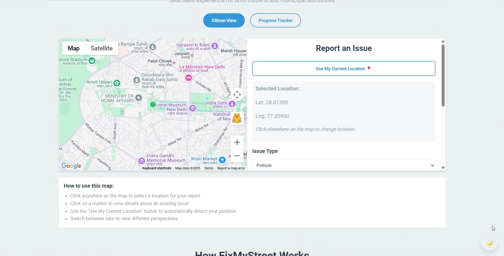
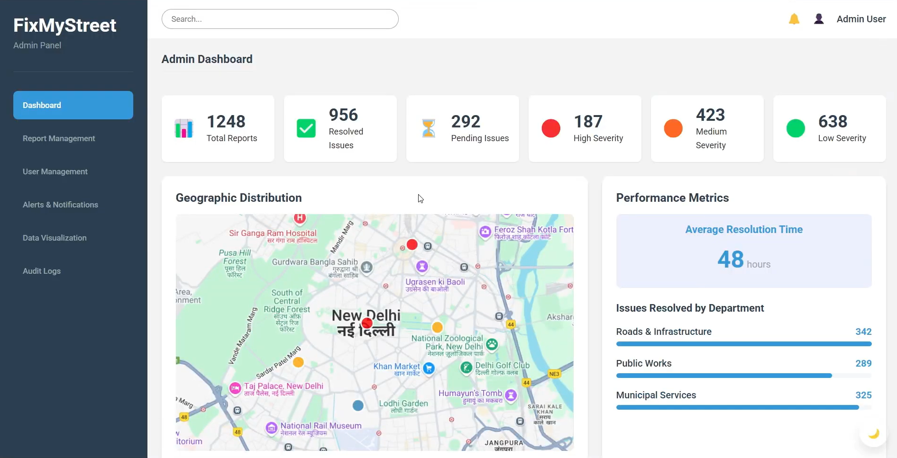
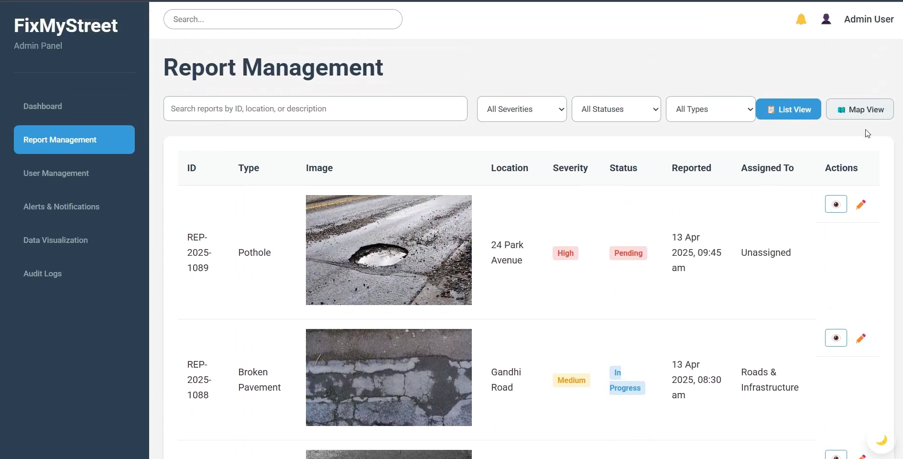

# 🚧 FixMyStreet

**FixMyStreet** is a civic tech platform that empowers citizens to report road issues like potholes and broken pavements. Built using **React**, **Laravel**, and **OpenCV**, the platform facilitates real-time issue reporting, AI-powered damage detection, and transparent complaint tracking — driving accountability and improving road safety across urban India.

---

## 📸 Screenshots

Here’s a preview of FixMyStreet in action:

### 🏠 Homepage / Issue Reporting


### 📍 Geotagged Complaint Form


### 🧠 AI Pothole Detection Result


### 📊 Admin Dashboard (Complaint Tracker)


### 📊 Report Log (Admin)



---

## 📌 Table of Contents

- [Overview](#overview)
- [Features](#features)
- [Tech Stack](#tech-stack)
- [Architecture](#architecture)
- [Installation](#installation)
- [Usage](#usage)
- [AI Integration](#ai-integration)
- [Future Roadmap](#future-roadmap)
- [Contributors](#contributors)
- [License](#license)

---

## 🛣️ Overview

India loses thousands of lives every year due to poor road infrastructure. Citizens often lack a streamlined way to report these issues — and authorities struggle to prioritize repairs due to unclear data.

**FixMyStreet bridges this civic gap by providing:**

- 🗺️ A user-friendly platform for reporting road damage with geotagged images
- 🧠 AI-powered pothole detection and severity analysis using OpenCV
- 📊 A real-time dashboard for municipal authorities to manage complaints and resolutions
- 📬 Transparent status updates for complainants

> *FixMyStreet is not just a reporting tool — it’s a step toward smarter, safer, and more accountable cities.*

---

## ⚙️ Tech Stack

### 🖥️ Frontend

- **React** (JavaScript)
- **Tailwind CSS** (or Bootstrap - as per actual codebase)

### 🛠️ Backend

- **Laravel** (PHP)
- **MySQL**

### 🧠 AI & Image Processing

- **Python + OpenCV** (for image analysis)
- **OpenCV.js** (for in-browser pothole preview – optional)

### ☁️ Deployment

- **GitHub**
- **Vercel** (Frontend)
- **Railway/Render** (Backend – Optional)

---

## 🧱 Architecture
User (Frontend - React)
↓
Report with Image & Location
↓
Backend API (Laravel)
↓
AI Service (Python + OpenCV)
↓
Pothole Verification + Severity Detection
↓
Database (MySQL)
↓
Admin Dashboard & Citizen Complaint Status


---

## 🚀 Installation

### 🧩 Prerequisites

- Node.js & npm
- Composer
- PHP & Laravel
- Python 3 (for AI)
- MySQL Server

### 📦 Frontend Setup

```bash
git clone https://github.com/Swapnil220705/FixMyStreet.git
cd FixMyStreet/frontend
npm install
npm start
```
- Visit: http://localhost:3000

---

### 🔧 Backend Setup

```bash
cd ../backend
composer install
php artisan migrate
php artisan serve
```
- Configure .env for database credentials.

---
### ✨ Features
- 📸 Image-Based Reporting – Upload pictures of road damage with geolocation

- 🤖 AI-Powered Pothole Detection – Uses OpenCV to verify issues and assign severity levels

- 📡 Real-Time Dashboard – Authorities view, prioritize, and update complaints

- 📨 Complaint Status Updates – Citizens get notified as their issue progresses

- 🧾 Data Logging – All reports are stored and tracked for auditability

---
### 🧠 AI Integration

We use OpenCV to analyze uploaded images and detect potholes. This includes:

- Contour detection

- Morphological operations

- Severity scoring based on depth and spread

```This AI module is built in Python and optionally integrates with the backend via API or as a pre-processing tool.```

---
### 📈 Future Roadmap

 - 🔦 Add support for reporting streetlight outages and waterlogging

 - 🗺️ Interactive heatmaps for complaint clustering

 - 💬 Multilingual UI support (Hindi, Marathi, Bengali, etc.)

 - 📱 Native mobile app (React Native or Flutter)

 - 🏅 Citizen reputation & gamification system

---
### 🙌 Contributors

| Name         | GitHub Handle                                      |
| ------------ | -------------------------------------------------- |
| Arnab Mistry | [@ArnabMistry](https://github.com/ArnabMistry)     |
| Swapnil Jain | [@Swapnil220705](https://github.com/Swapnil220705) |
| Arnav Timble | [@Arnz18](https://github.com/Arnz18)               |
| Ojaswi Joshi | [@OjaswiJoshi13](https://github.com/OjaswiJoshi13) |

```Together, we can pave the road to smarter civic infrastructure.```


